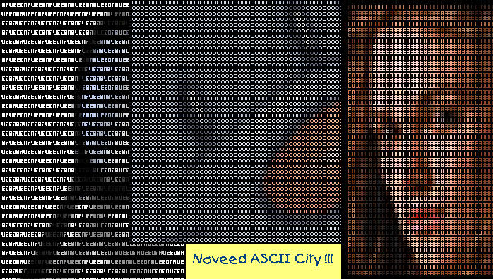



## New ASCII City\! Convert your high\-resolution photos to colorful ASCII pictures in HTML format

### Description

(Must See Preview) - All errors removed - now can convert any size of picture !!! ASCII City is a powerful utility to convert any kind of picture (bitmap, jpeg, gifs, icons and so on) to colorful ASCII Picture in HTML formatted codes. Four 'Qualities' are available from 'Excellent' to 'Worst'. Preview after Making/Conversion available. Just browse, paste or drag'n'drop picture file in to input area, set 'Options' (defaults are the best) and hit 'Make' button !!! Believe me, you will get the FINEST, most COMPRESSED and extremely FAST results from ASCII City. I have tried my best to generate fast results and you will see when you use it. Codes are well commented. Hay wait, vote for me if you like; And please leave comments if u have any :D
 
### More Info
 

             |
---                |---
**Submitted On**   |2003-12-06 08:16:18
**By**             |[Naveed ur Rahman](https://github.com/Planet-Source-Code/PSCIndex/blob/master/ByAuthor/naveed-ur-rahman.md)
**Level**          |Advanced
**User Rating**    |4.7 (121 globes from 26 users)
**Compatibility**  |VB 5\.0, VB 6\.0
**Category**       |[Complete Applications](https://github.com/Planet-Source-Code/PSCIndex/blob/master/ByCategory/complete-applications__1-27.md)
**World**          |[Visual Basic](https://github.com/Planet-Source-Code/PSCIndex/blob/master/ByWorld/visual-basic.md)
**Archive File**   |[New\_ASCII\_1694201142004\.zip](https://github.com/Planet-Source-Code/naveed-ur-rahman-new-ascii-city-convert-your-high-resolution-photos-to-colorful-ascii-pict__1-50993/archive/master.zip)

